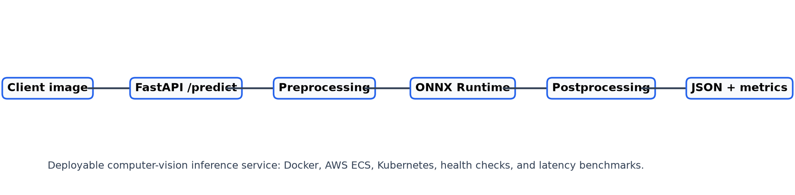

# Cloud-Native-CV-Inference-Server


Deployable computer-vision inference service built with FastAPI, ONNX Runtime, Docker, AWS notes, Kubernetes manifests, health checks, and latency benchmarking.



## What It Does

- Accepts image uploads through `/predict`.
- Decodes images with OpenCV and prepares NCHW tensors for ONNX Runtime.
- Runs a configured ONNX model when `models/model.onnx` is available.
- Keeps the API usable before model setup by returning validated demo metadata.
- Exposes `/health` and `/metrics` for deployment checks.
- Includes Docker Compose, AWS ECS notes, Kubernetes manifests, and a benchmark script.

## Demo Input

The default benchmark image is a small CC0 image from Wikimedia Commons:

```text
sample_data/demo_images/dog_on_log_cc0.jpg
```

Source and license records are kept in `sample_data/ASSET_SOURCES.md`.

## Pipeline

```text
Client image
  -> FastAPI /predict
  -> OpenCV decode
  -> Tensor preprocessing
  -> ONNX Runtime session
  -> Output summary
  -> JSON response + metrics
```

## Quick Start

```powershell
python -m venv .venv
.\.venv\Scripts\activate
pip install -r requirements.txt
uvicorn app.main:app --reload
```

Open:

```text
http://127.0.0.1:8000/health
http://127.0.0.1:8000/docs
```

## Benchmark

Start the API, then run:

```powershell
python scripts/benchmark_latency.py --runs 10
```

## Model Setup

Place an ONNX model at:

```text
models/model.onnx
```

Or set:

```powershell
$env:MODEL_PATH = "models\your_model.onnx"
```

If the file is missing or unreadable, `/predict` still validates the uploaded image and returns a clear `model_loaded: false` response.

## Docker

```powershell
docker compose up --build
```

## Repository Layout

```text
app/          FastAPI routes, settings, inference services, utilities
models/       local ONNX model location
sample_data/  demo image and asset source records
scripts/      model, benchmark, and deployment helpers
infra/        AWS and Kubernetes examples
docs/         architecture and deployment notes
tests/        API and preprocessing checks
```

## Deployment Notes

- Push Docker image to ECR: `scripts/push_to_ecr.sh`
- Deploy to ECS: `scripts/deploy_ecs.md` and `infra/aws/`
- Deploy to Kubernetes: `infra/k8s/` and `docs/deployment_kubernetes.md`
